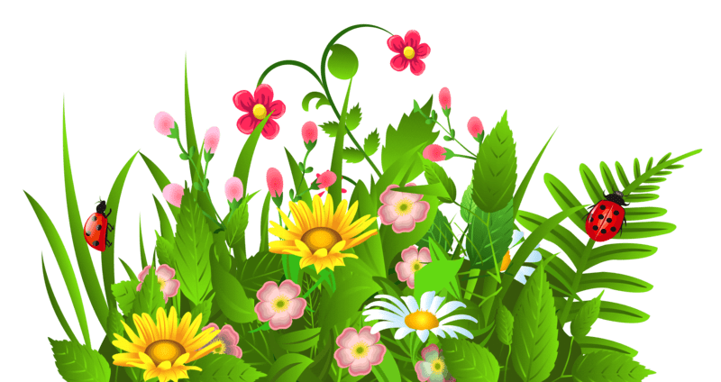

# 🌚 Adventures with Evolution 🌚

  

## 📝 Table of Contents

- [About](#-about-)
- [Getting Started](#-getting-started-)
- [Configurations and Variants](#-configurations-and-variants-)
- [Animal and grass](#-animal-and-grass-)
- [Structure](#-structure-)
- [Statistics](#-statistic-)
- [How to use?](#%EF%B8%8F-how-to-use-)
- [Authors](#%EF%B8%8F-authors-)

## 	🌠About 

The world of our game is quite simple. It consists of a regular, rectangular area divided into square fields.
Most of the world is covered by steppes, on which few plants grow that serve as food for animals.
However, some regions are overgrown with jungle, where plants grow much faster.
Plants will grow in random places, but their concentration will be greater in the jungle (brighter places 💚) than on the steppe (darker places 💙).
Our herbivorous animals 🐨 will traverse this world in search of food.
Each animal has a certain energy level, which decreases every day.
Finding and eating a plant 🌼 increases the energy level by a certain value.

## 🏁 Getting Started 
At the beginning, we can create a map configuration or
choose one of the ready-made ones and start the simulation!
After you create a simulation, it will be saved and can be later reproduced!

  

## 💥 Configurations and variants: 
Certain aspects of the simulation are configurable and can significantly change its course.
Some of them are simple numerical parameters (e.g. initial population size 	👽).
However, some of them significantly modify its rules 👈 .
This applies in particular to: map behavior, plant growth behavior, mutation behavior, animal behavior.

#### 🌗 In the case of the map, the key is how we handle its edges.
#### We will implement the following variants:

* 🌗 `Earth ball` - the left and right edges of the map loop (if the animal goes beyond the left edge, it appears on the right side - and if it goes beyond the right edge, it appears on the left); the top and bottom edges of the map are poles - you cannot enter them (if the animal tries to go beyond these edges of the map, it remains on the field it was on, and its direction changes to the opposite);
* 🌗 `Hellish portal` - if the animal goes beyond the edge of the map, it goes to a magic portal; its energy decreases by a certain value (the same as in the case of generating offspring), and then it is teleported to a new, random place on the map.

#### 🌱 In the case of plant growth, certain fields are strongly preferred, according to the Pareto principle.
There is an 80% chance that a new plant will grow on a preferred field, and only a 20% chance that it will grow on a field of the second category. Approximately 20% of all places on the map are preferred, 80% of places are considered unappealing.

#### 🌱 We implement the following variants:

* 🌱 `Wooded equator` - the plants prefer a horizontal strip of fields in the central part of the map (imitating the equator and surroundings);
* 🌱 `Toxic corpses` - plants prefer those fields on which animals die less frequently - they grow on those fields on which the least number of animals have ended their lives during the simulation.

#### 💌 In the case of mutations, we have two simple options:

* 💌 `Full randomness` - mutation changes the gene to any other gene;
* 💌 `Light correction` - mutation changes the gene by 1 up or down (e.g. gene 3 can be changed to 2 or 4, and gene 0 to 1 or 7). In the case of animal behavior, we can distinguish the following options:

Now you can choose one of them and press the confirm button 👍 !

  

### 🙊 Animal and grass: 

  

We need to track several characteristics of each animal.
First, for both plants and those that eat them, we need to know the `x` and `y` coordinates. 
They tell us where the animal or plant is on the map. 
We also need to know how much energy the animal has.

#### Just look at the energy bar or 💨 hover over the animal to see information about its energy 💜 .

  

#### We can also click on the animal to see more detailed information about it.

  

#### If the animal is surrounded by a green border, it means that its active gene is dominant.

  

## 🔧 Structure: 

We can always open new windows and create new simulations!
Remember, if you want to see information about the animal, you need to stop the simulation with the stop button! 
After you're finished, press exit.  ✍️

## 	👀 Statistic:  

You can also view charts related to the simulation by clicking on the information frame on the right side of the map.

  

## ⛏️ How to use? 

[Here you can check more information about project.](docs/README.md)

🎥 Check example video [here](https://www.youtube.com/watch?v=ei7FTJV72RA)

Have fun creating and observing how the universe behaves! Enjoy!
This is our animals and grass!

  

    
    
    
  

  

    
    
    
  

## ✍️ Authors 

- [Natalia Luberda](https://github.com/NataliaLuberda)
- [Michał Kobiera](https://github.com/MicelloK)
